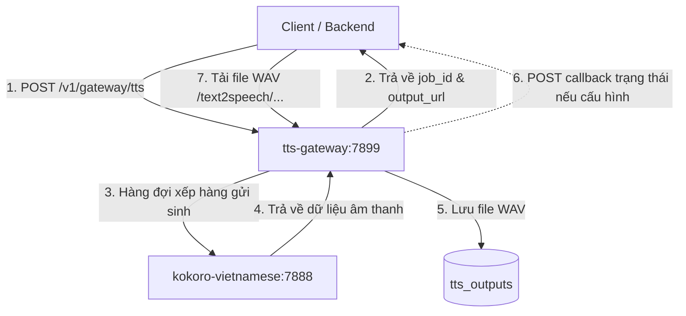

# Hướng Dẫn Sử Dụng Docker - Kokoro Vietnamese

Tài liệu này hướng dẫn cách chạy và sử dụng dịch vụ sinh giọng nói tiếng Việt bằng **Kokoro-Vietnamese** thông qua **Docker** và **Docker Compose**.

Hệ thống được thiết kế theo kiến trúc 2 lớp tương tự như dự án `supertonic`:
1. **Inference Engine (`kokoro-vietnamese`)**: Máy chủ thực hiện chuyển đổi text-to-speech sử dụng mô hình ONNX chạy trên CPU (Cổng mặc định: `7888`).
2. **Gateway (`tts-gateway`)**: Wrapper API quản lý hàng đợi (queue), xử lý bất đồng bộ (async jobs), thông báo webhook (callbacks) và phục vụ tải file âm thanh đầu ra (Cổng mặc định: `7899`).

---

## 1. Cấu Trúc Hệ Thống



---

## 2. Chuẩn Bị & Khởi Chạy

### Khởi Chạy Services
Để build các image cục bộ và bắt đầu chạy container, thực hiện lệnh dưới đây tại thư mục gốc của dự án:

```bash
docker compose up -d --build
```

**Quá trình này sẽ:**
- Tải toàn bộ các dependencies cần thiết.
- Tải trước mô hình nền tảng ONNX và toàn bộ 14 giọng đọc tiếng Việt (đã tối ưu hóa lưu vào image) để đảm bảo container có thể khởi động và chạy offline hoàn toàn.
- Khởi động máy chủ sinh giọng nói trên cổng `7888`.
- Khởi động Gateway quản lý hàng đợi trên cổng `7899`.

### Kiểm Tra Trạng Thái
Sau khi khởi chạy thành công, bạn có thể gọi API kiểm tra trạng thái sức khỏe:
- **Inference Engine health**: `http://localhost:7888/v1/health`
- **Gateway health**: `http://localhost:7899/health`

---

## 3. Cách Sử Dụng API thông qua Gateway (Cổng 7899)

### 3.1. Gửi Yêu Cầu Tạo Giọng Nói (Bất Đồng Bộ)
Gửi yêu cầu tới gateway để đưa vào hàng đợi:

* **Endpoint**: `POST /v1/gateway/tts`
* **Headers**: `Content-Type: application/json`
* **Request Body**:
```json
{
  "user_id": "hutuki_admin",
  "text": "Chào bạn, đây là thử nghiệm tạo giọng nói tiếng Việt bằng Kokoro qua Docker.",
  "voice": "diem_trinh",
  "speed": 1.0,
  "response_format": "wav"
}
```

* **Ví dụ CURL**:
```bash
curl -X POST http://localhost:7899/v1/gateway/tts \
  -H "Content-Type: application/json" \
  -d '{
    "user_id": "hutuki_admin",
    "text": "Chào bạn, đây là thử nghiệm tạo giọng nói tiếng Việt bằng Kokoro qua Docker.",
    "voice": "diem_trinh",
    "speed": 1.0
  }'
```

* **Response Trả Về Ngay Lập Tức**:
```json
{
  "job_id": "27fd94ad4e534f3ca4e8df5e8c1a79f5",
  "user_id": "hutuki_admin",
  "output_filename": "27fd94ad4e534f3ca4e8df5e8c1a79f5.wav",
  "output_url": "http://127.0.0.1:7899/hutuki_admin/27fd94ad4e534f3ca4e8df5e8c1a79f5.wav",
  "status": "queued"
}
```

---

### 3.2. Kiểm Tra Trạng Thái Của Job
Bạn dùng `job_id` nhận được ở bước trên để theo dõi tiến độ xử lý file.

* **Endpoint**: `GET /v1/gateway/jobs/{job_id}`
* **Ví dụ CURL**:
```bash
curl http://localhost:7899/v1/gateway/jobs/27fd94ad4e534f3ca4e8df5e8c1a79f5
```

* **Response**:
```json
{
  "job_id": "27fd94ad4e534f3ca4e8df5e8c1a79f5",
  "user_id": "hutuki_admin",
  "status": "done",
  "output_filename": "27fd94ad4e534f3ca4e8df5e8c1a79f5.wav",
  "output_url": "http://127.0.0.1:7899/hutuki_admin/27fd94ad4e534f3ca4e8df5e8c1a79f5.wav",
  "error": null,
  "bytes": 284020,
  "created_at": 1718911042.12,
  "started_at": 1718911042.15,
  "finished_at": 1718911043.85
}
```
*(Trạng thái `status` có các giá trị: `queued` | `running` | `done` | `failed`)*

---

### 3.3. Tải File Âm Thanh Kết Quả
Sau khi trạng thái job chuyển sang `done`, bạn có thể tải trực tiếp file âm thanh từ endpoint tải file của Gateway:

* **Endpoint**: `GET /text2speech/{userid}/{filename}`
* **Ví dụ CURL**:
```bash
curl http://localhost:7899/text2speech/hutuki_admin/27fd94ad4e534f3ca4e8df5e8c1a79f5.wav --output result.wav
```

---

## 4. Gọi Trực Tiếp Inference Engine (Đồng Bộ - Cổng 7888)

Nếu không muốn qua cơ chế hàng đợi bất đồng bộ của Gateway mà muốn nhận về trực tiếp luồng stream âm thanh tức thời, bạn có thể gọi trực tiếp máy chủ sinh:

* **Endpoint**: `POST /v1/tts`
* **Headers**: `Content-Type: application/json`
* **Request Body**:
```json
{
  "text": "Chào bạn, sinh âm thanh đồng bộ không qua gateway.",
  "voice": "ngoc_huyen",
  "speed": 1.0,
  "response_format": "wav"
}
```
* **Ví dụ CURL**:
```bash
curl -X POST http://localhost:7888/v1/tts \
  -H "Content-Type: application/json" \
  -d '{
    "text": "Chào bạn, sinh âm thanh đồng bộ không qua gateway.",
    "voice": "ngoc_huyen",
    "speed": 1.0
  }' --output direct.wav
```

---

## 5. Danh Sách Giọng Đọc (Vietnamese Voices)

Bạn có thể truyền tên giọng đọc vào trường `"voice"`:

| Tên (Voice Key) | Giới tính / Mô tả |
| :--- | :--- |
| `diem_trinh` | Nữ (Diễm Trinh - Mặc định) |
| `hung_thinh` | Nam (Hưng Thịnh) |
| `mai_linh` | Nữ (Mai Linh) |
| `mai_loan` | Nữ (Mai Loan) |
| `manh_dung` | Nam (Mạnh Dũng) |
| `my_yen` | Nữ (Mỹ Yến) |
| `ngoc_huyen` | Nữ (Ngọc Huyền) |
| `phat_tai` | Nam (Phát Tài) |
| `thanh_dat` | Nam (Thành Đạt) |
| `thuc_trinh` | Nữ (Thục Trinh) |
| `tuan_ngoc` | Nam (Tuấn Ngọc) |
| `storyvert` | Giọng kể chuyện (storyvert) |
| `duc_an` | Nam (Đức An) |
| `duc_duy` | Nam (Đức Duy) |
